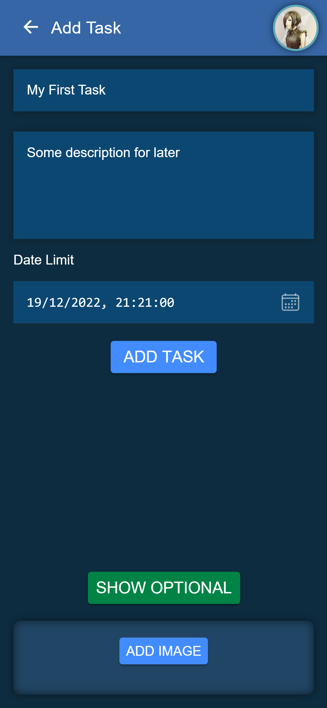
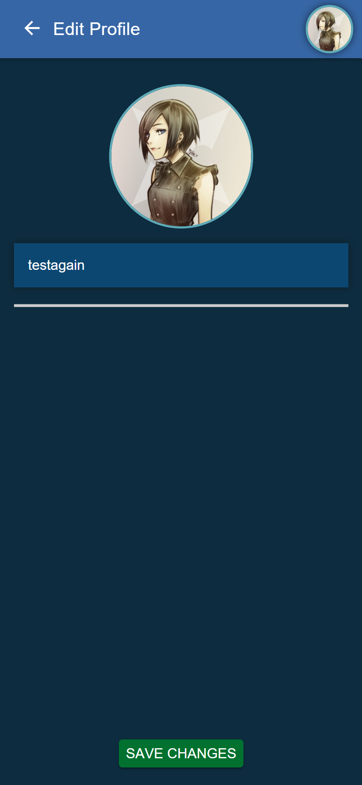
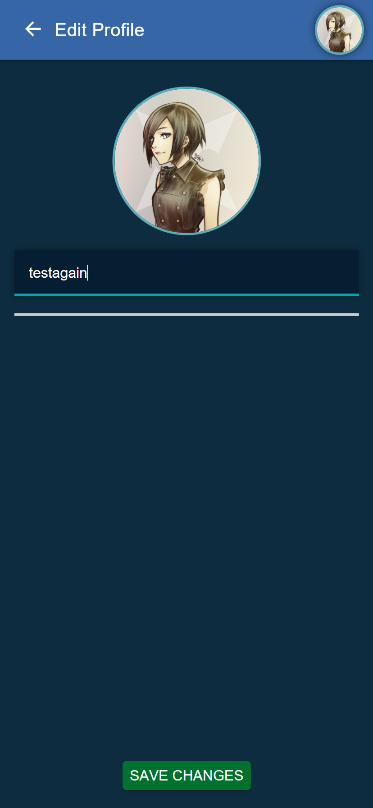

# Task Manager

<a href="https://github.com/Danny-06/proyecto-integrado/raw/master/TaskManager.apk">
  Haz click aquí para descargar la APK
</a>

## Anteproyecto

El proyecto será realizado con Ionic/Angular.

El proposito de este proyecto es crear una aplicación
que pueda usar cualquier persona. 
En ella cada usuario
puede manejar su propia lista de tareas (añadir, editar, borrar) y además
puede agregar a otros usuarios y ver sus tareas.

  
  
  

## API Firebase Admin (Python)
https://github.com/Danny-06/python-firebase-admin

## Admin Panel (Angular)
https://github.com/Danny-06/task-manager-administrator-app

## Landing Page
https://github.com/Danny-06/landing-page-proyecto-integrado

## Registro

### Bibliografía
https://firebase.google.com/  
https://www.bezkoder.com/firebase-storage-angular-10-file-upload/  
https://capacitorjs.com/docs/guides/push-notifications-firebase  
https://enappd.com/blog/how-to-implement-firebase-push-notifications-in-ionic-apps/157/  
https://stackoverflow.com/questions/38800414/delete-a-specific-user-from-firebase

### Semana 1
Registro y Login completados 
Pagina de listado y pagina de crear tareas
Visualizar Tareas 
Editar Tareas. Borrar imágenes 
Enlace de la APK

### Semana 2
Añadido botón para ordenar tareas 
Más filtros añadidos y mejora en la visualización de estados de una tarea 

### Semana 3
Página para editar nombre y foto de perfil 
Mostrar email en perfil 
Mostrar otros detalles en perfil 
Añadir funcionalidad offline limitada 
Animación de carga añadida 

## Capturas

[//] # emmet string to generate below HTML
[//] # table>(tr>td>img[width="400"][src="./app-screenshots/screenshot-$.png"])*27

<table>
    <tr>
        <td></td>
    </tr>
    <tr>
        <td></td>
    </tr>
    <tr>
        <td></td>
    </tr>
    <tr>
        <td></td>
    </tr>
    <tr>
        <td></td>
    </tr>
    <tr>
        <td></td>
    </tr>
    <tr>
        <td></td>
    </tr>
    <tr>
        <td></td>
    </tr>
    <tr>
        <td></td>
    </tr>
    <tr>
        <td></td>
    </tr>
    <tr>
        <td></td>
    </tr>
    <tr>
        <td></td>
    </tr>
    <tr>
        <td></td>
    </tr>
    <tr>
        <td></td>
    </tr>
    <tr>
        <td></td>
    </tr>
    <tr>
        <td></td>
    </tr>
    <tr>
        <td></td>
    </tr>
    <tr>
        <td></td>
    </tr>
    <tr>
        <td></td>
    </tr>
    <tr>
        <td></td>
    </tr>
    <tr>
        <td></td>
    </tr>
    <tr>
        <td></td>
    </tr>
    <tr>
        <td></td>
    </tr>
    <tr>
        <td></td>
    </tr>
    <tr>
        <td></td>
    </tr>
    <tr>
        <td></td>
    </tr>
    <tr>
        <td></td>
    </tr>
</table>
